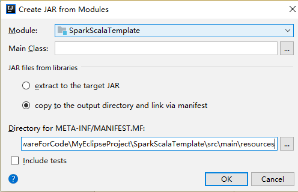

java.io.IOException: Could not locate executable null\bin\winutils.exe in the Hadoop binaries.  
这个报错可以忽略，不影响运行    
也可以下载 hadoop的tar.gz包，解压到某个目录，添加环境变量  
HADOOP_HOME=hadoop解压目录  
path中添加一个新的路径%HADOOP_HOME%\bin  
然后到 [这里](https://github.com/steveloughran/winutils)  下载winutils.exe和hadoop.dll，放在%HADOOP_HOME%\bin目录下  

在idea中远程提交的时候，如果本机上有多个网卡，有的虚拟网卡的地址是192.168.173.1这种，
和spark集群不在同一个网段，应用在运行过程中，netty可能会用这个ip创建一个本地的节点，来和集群通信，
但是因为不在同一个网段，无法通信成功，导致运行失败；暂时的解决办法是：将除了局域网卡的其他有ipv4地址的虚拟网卡禁用；
windowns下面通过ipconfig来查看网卡信息；  

如果SparkUI采用的ip地址和spark集群在同一个网段，就ok  
SparkUI: Bound SparkUI to 0.0.0.0, and started at http://192.168.1.66:4040  

如果遇到下面的警告，可能是还有其他spark任务正在执行，而且占用了所有的core，导致新建的任务没有资源可以使用  
可以到 http://YOUR_SPARK_MASTER_IP:8080 页面中停止旧的任务（如果可以的话）  
Initial job has not accepted any resources; check your cluster UI to ensure that workers are registered and have sufficient resources

打包设置，基础依赖包（spark和hadoop环境中已有的包）全部删除，仅包含自己的代码和第三方包    



Spark Task Template For IDEA
```scala
#if ((${PACKAGE_NAME} && ${PACKAGE_NAME} != ""))package ${PACKAGE_NAME} #end

import java.util.Scanner

import com.xiyuan.spark.conf.SparkConfFactory
import org.apache.spark.SparkContext

/**
  * Created by ${USER} on ${DATE} ${TIME}.
  */    
object ${NAME} {

  def main(args: Array[String]) {
    val conf = SparkConfFactory.fromSparkProperties().setAppName(${NAME}.getClass.getSimpleName)

    val context = new SparkContext(conf)
    val logFile = context.textFile("hdfs://192.168.1.120:9000/spark-root-org.apache.spark.deploy.master.Master-1-node120.out")
    logFile.flatMap(_.split(" ")).map((_, 1)).reduceByKey(_ + _).sortBy(-_._2).collect().foreach(println)

//    println("press enter to exit")
//    new Scanner(System.in).nextLine()
    context.stop()
  }

}
```